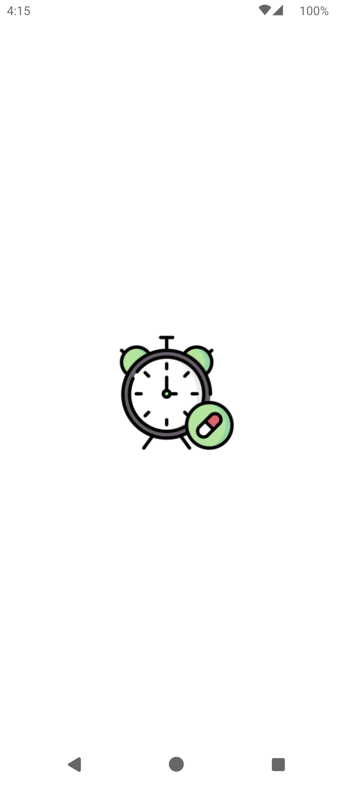
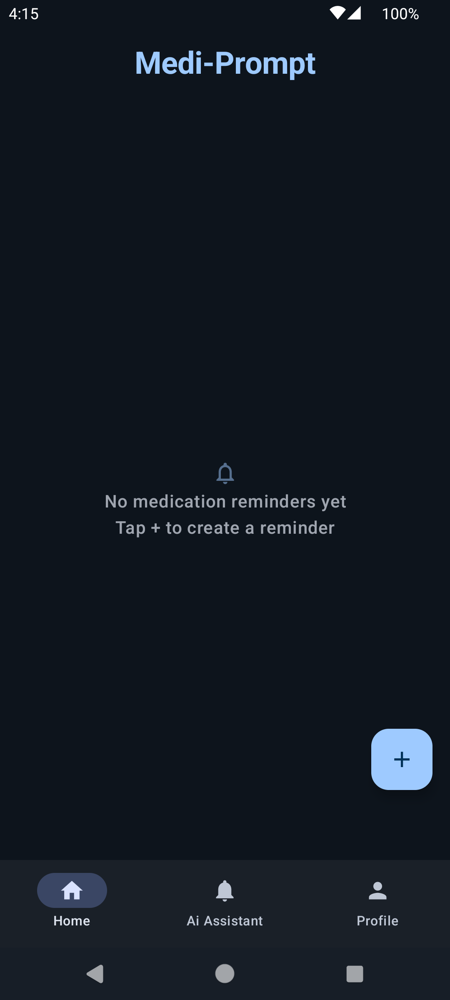
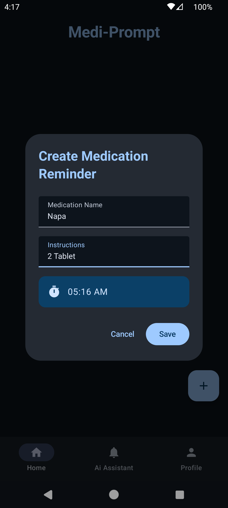
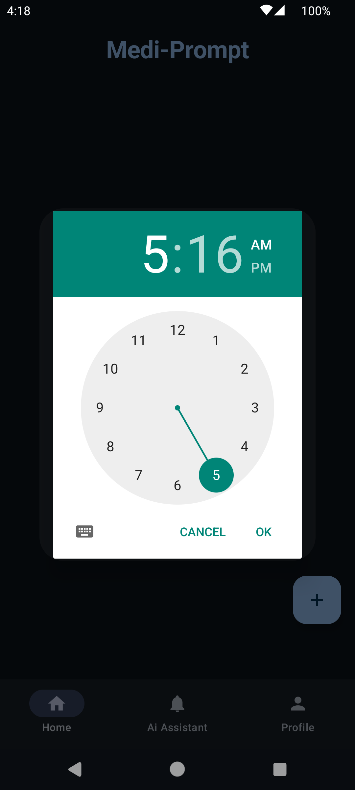
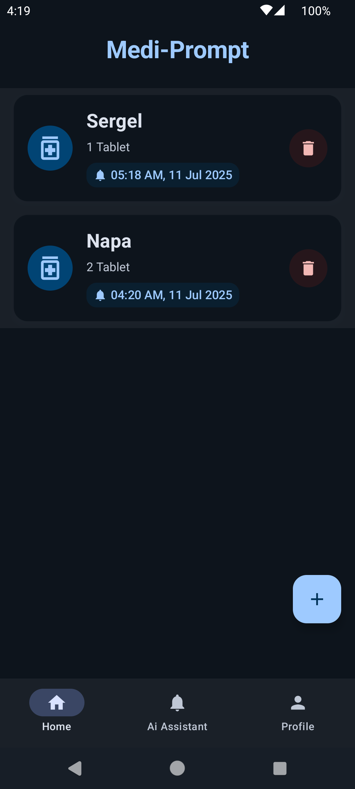
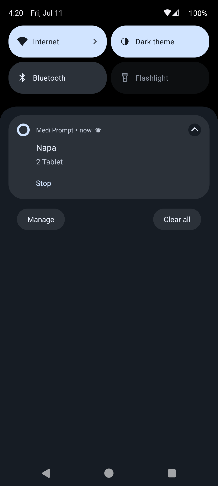
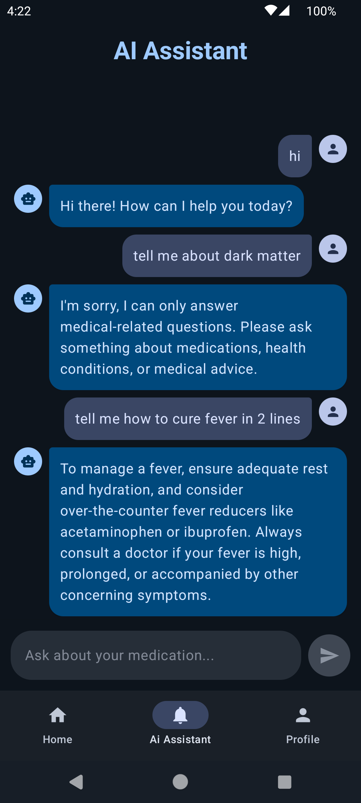
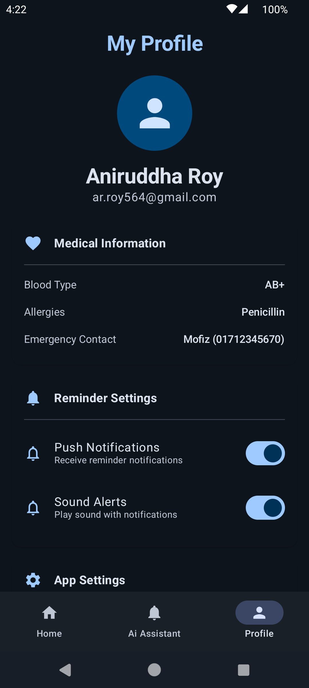
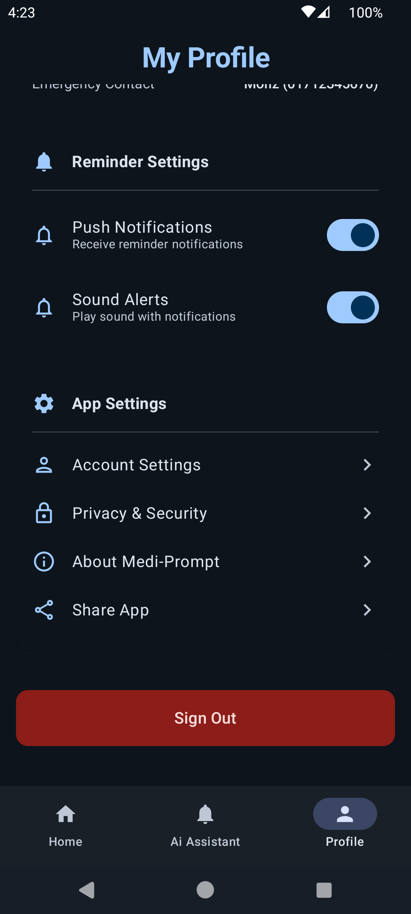

# Medi-Prompt


## 📱 Overview

Medi-Prompt is a modern Android application designed to help users manage their medication schedules efficiently. The app provides timely reminders for medication intake, offers an AI assistant for medication-related queries, and includes a user profile section for managing personal medical information.

<p align="center">
  
</p>

## ✨ Features

### 🔔 Medication Reminders
- Create and manage medication alarms with custom titles and instructions
- Set precise time schedules for medication intake
- Receive notifications when it's time to take medication
- Elegant swipe-to-delete functionality with animations

<p align="center">
  
  
  
</p>

<p align="center">
  
  
</p>

### 🤖 AI Assistant
- Chat with an AI assistant about medication questions
- Get information about dosage, side effects, and interactions
- Modern chat interface with avatar indicators and smooth animations

<p align="center">
  
</p>

### 👤 User Profile
- Store personal medical information (blood type, allergies, emergency contacts)
- Customize notification preferences
- Manage app settings and privacy options

<p align="center">
  
  
</p>

## 🏗️ Architecture & Technical Implementation

### MVVM Architecture

Medi-Prompt follows the Model-View-ViewModel (MVVM) architectural pattern, which provides a clean separation of concerns:

#### Model Layer
- **Data Classes**: `Alarm.kt`, `MessageModel.kt`
- **Repository Pattern**: `AlarmRepository.kt` interface with `AlarmRepoImpl.kt` implementation
- **Local Database**: Room database with `AlarmDao.kt` for data access operations

#### View Layer
- **UI Components**: Built using Jetpack Compose for a modern, declarative UI
- **Screen Composables**: `HomeScreen.kt`, `AiAssistantPage.kt`, `ProfilePage.kt`
- **UI Elements**: Customized composables like `AlarmItem.kt`, `MessageRow.kt`

#### ViewModel Layer
- **ViewModels**: `AlarmActivityViewModel.kt`, `ChatViewModel.kt`
- **State Management**: Using StateFlow and MutableState for reactive UI updates
- **Business Logic**: Handling data operations and UI state management

### Dependency Injection
- Used Dagger Hilt for dependency injection (`AlarmDiModule.kt`)
- Provides singleton instances for repositories, database, and other dependencies

### Background Processing
- Implemented alarm scheduling using `AlarmManager` with `AlarmScheduler.kt` interface
- Created `AlarmReceiver.kt` for handling alarm notifications in the background

## 💻 Development Process

### Phase 1: Project Setup and Core Functionality
- Set up the Android project with Kotlin and Jetpack Compose
- Implemented MVVM architecture with Room database for local storage
- Created basic UI structure for the three main screens
- Implemented core alarm functionality with proper scheduling

### Phase 2: UI Enhancement and UX Improvement
- Refined UI components with Material Design 3 principles
- Added animations for improved user experience
- Implemented swipe-to-delete functionality with interactive feedback
- Created responsive layouts for different screen sizes

### Phase 3: AI Assistant Integration
- Developed chat interface for AI interactions
- Implemented message exchange system
- Styled chat bubbles and input fields for better readability
- Added avatar indicators to distinguish between user and AI messages

### Phase 4: Profile Features and Final Polish
- Implemented user profile UI with medical information sections
- Added settings toggles and preference management
- Applied consistent styling across the application
- Enhanced accessibility features and optimized performance

## 🛠️ Technologies Used

- **Language**: Kotlin
- **UI Framework**: Jetpack Compose
- **Architecture**: MVVM (Model-View-ViewModel)
- **Database**: Room Persistence Library
- **Dependency Injection**: Dagger Hilt
- **Concurrency**: Kotlin Coroutines & Flow
- **Scheduling**: Android AlarmManager
- **Animation**: Jetpack Compose Animation APIs

## 📁 Project Structure

```
com.aniruddha81.mediprompt/
├── alarm/                     # Alarm scheduling logic
├── data/                      # Data handling
│   ├── local/                 # Local database implementation
│   └── repository/            # Repository pattern implementation
├── di/                        # Dependency injection modules
├── models/                    # Data models and entities
├── pages/                     # UI screens and components
│   ├── aiAsstPage/            # AI Assistant page components
│   ├── alarmPage/             # Alarm/reminder page components
│   └── profilePage/           # User profile page components
├── receiver/                  # Broadcast receivers for alarms
├── services/                  # Application services
├── ui/                        # Theme and styling
│   └── theme/
├── viewModels/                # ViewModels for each feature
├── AlarmApp.kt                # Application class
├── Constants.kt               # App-wide constants
├── MainActivity.kt            # Entry point of the application
└── MainScreen.kt              # Main navigation container
```

## 🚀 Getting Started

### Prerequisites
- Android Studio Arctic Fox or higher
- Android SDK 21+
- Kotlin 1.5+

### Installation
1. Clone this repository
2. Open the project in Android Studio
3. Sync Gradle files
4. Run the app on an emulator or physical device

## 📝 License

This project is licensed under the MIT License - see the LICENSE file for details.

## 👨‍💻 Author

Aniruddha - [GitHub Profile](https://github.com/aniruddha81)
